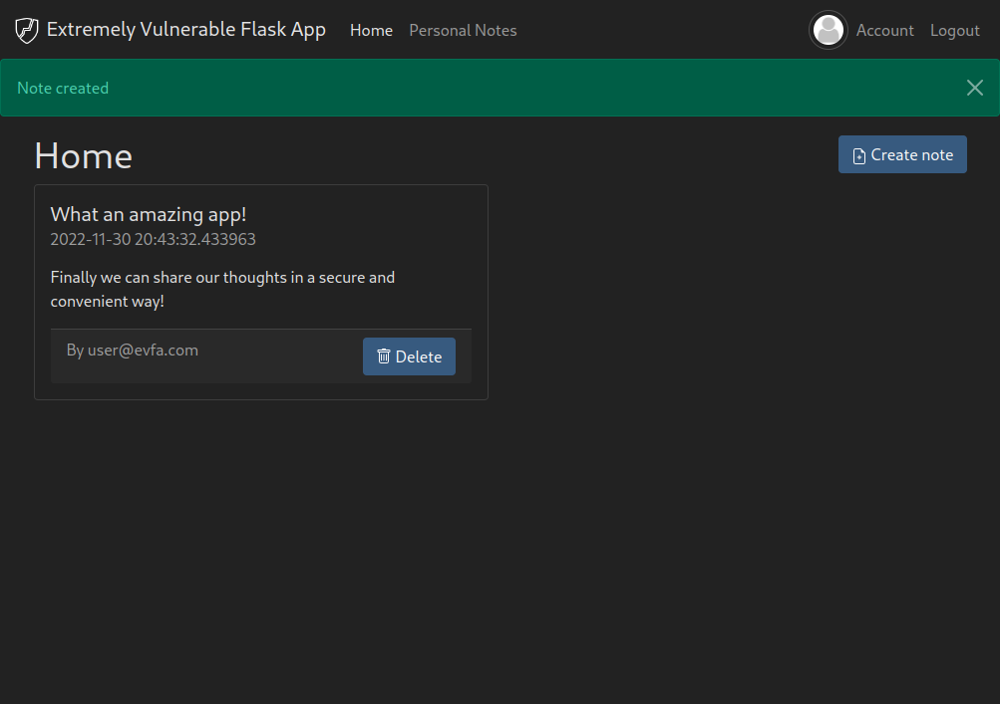

# Extremely Vulnerable Flask App

[](https://github.com/manuelz120/extremely-vulnerable-flask-app/actions/workflows/pylint.yml)

Intentionally vulnerable Python / Flask application, built for educational purposes.



## Setup

Using `python3` and [venv](https://docs.python.org/3/library/venv.html):

```bash
git clone https://github.com/manuelz120/extremely-vulnerable-flask-app
cd extremely-vulnerable-flask-app
python3 -m venv .venv
source .venv/bin/activate
pip install -r requirements.txt
python3 -m flask run # Can be stopped using CTRL+C
```

Using `docker`:

```bash
git clone https://github.com/manuelz120/extremely-vulnerable-flask-app
cd extremely-vulnerable-flask-app
docker build . -t extremely_vulnerable_flask_app
docker run --name extremely_vulnerable_flask_app -p 5000:80 extremely_vulnerable_flask_app  # Can be stopped using CTRL+C or by running `docker kill extremely_vulnerable_flask_app`
```

Using `docker-compose`:

```bash
docker-compose up --build
```

Afterwards, the app should be running at http://localhost:5000

In case port 5000 is already occupied on your system, feel free to change it to something else by adjusting the Docker / compose port mapping or adding the `-p <desired-port>` parameter when starting flask.

## Disclaimer ⚠️

**This app is really vulnerable!** 💣

- Don't run it on publicly accessible server / public networks ⚠️
- Don't blindly copy code or use this as an example / template ⚠️
- Turn off after use ⚠️
- Use at your own risk ⚠️

## Getting started

Registration is based on invites. Either hack your way into the systems, or use the leaked invite code `a36e990b-0024-4d55-b74a-f8d7528e1764` to get started. Moreover, there are two predefined test users:

- `user@evfa.com:user` - normal user
- `admin@evfa.com:admin` - admin user

## Resetting state

Either create a fresh docker container, or remove the local database (`database.db`) and restart the app.

## Tools

- Python 3 + Flask
- SQLAlchemy + SQLite Database
- Jinja Templating
- [Bootstrap-Flask](https://bootstrap-flask.readthedocs.io/en/stable/)

## Vulnerability Documentation, Exploit scripts and solutions

TODO
